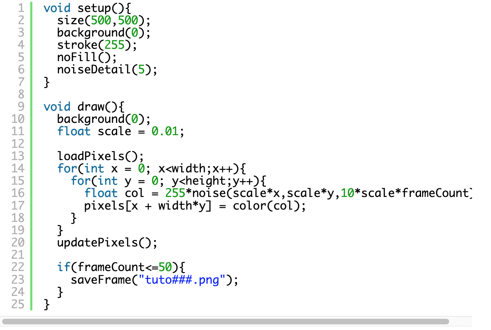

# Quiz 8
The first file on my git hub.

## Part 1: Imaging Technique Inspiration

The inspiration is from a YouTube video "Playing with Perlin Noise in p5.js - generative art with lots of options, plus wave convections", at:

[Playing with Perlin Noise in p5.js](https://www.youtube.com/watch?v=CSMcrKouQ3o)

The effect of ripples attracts me, which is triggered by dragging the mouse on the screen, and several ripples are stimulated to generate:

With time going on, the tiny random scale ripples grow larger, when they hit the edges of canvas, they get a force and go back as growing larger. Finally, the image gets engergetic with massive ripples:

As I plan to draw several dots in the assignment, the use of Perlin Noise in this reference can benefit the drawing of random but less messy figures by time. After deciding to use Perlin Noise, I watched these tutorials:

| Insights | Link |
| ----------- | ----------- |
| The basic rules of Perlin noise: A normal distribution of values between 0 and 1| [I.2: Introduction - Perlin Noise and p5.js Tutorial](https://www.youtube.com/watch?v=Qf4dIN99e2w) |
| The one dimension Perlin noise and how to visualise it | [I.4: Graphing 1D Perlin Noise - Perlin Noise and p5.js Tutorial](https://www.youtube.com/watch?v=y7sgcFhk6ZM&list=PLRqwX-V7Uu6ZV4yEcW3uDwOgGXKUUsPOM&index=5) |
| The two dimension Perlin noise and visualise it by a gray scale added on each pixel| [I.5: 2D Noise - Perlin Noise and p5.js Tutorial](https://www.youtube.com/watch?v=ikwNrFvnL3g&list=PLRqwX-V7Uu6ZV4yEcW3uDwOgGXKUUsPOM&index=6) |

## Part 2: Coding Technique Exploration

Perlin Noise is a tool in p5.js which can benefits the change of values to be stable by its smooth curve of value:

To connect the value of Perlin Noise to a figure to control its scale/location/color/time, we have to use several dimensions for controlling all of these effects in the canvas, which ask us to use the nested for loops to visit every value of the figures, such as:

([Drawing from noise, and then making animated loopy GIFs from there.](https://necessarydisorder.wordpress.com/2017/11/15/drawing-from-noise-and-then-making-animated-loopy-gifs-from-there/))

In this case for adding animation to the gray scale two dimensions cloudy image, the programmer add the frameCount to be the third dimension of the image:

`float col = 255*noise(scale*x,scale*y,10*scale*frameCount);`

By using the Perlin noise to control the scale, draw curve, and add animation, it will benefit the assignment. I still need to learn more by watching :ok_woman::

- [x] [Coding Challenge: Perlin Noise Flow Field](https://www.youtube.com/watch?v=BjoM9oKOAKY)
- [x] [Coding Challenge: Perlin Noise Loops](https://www.youtube.com/watch?v=ZI1dmHv3MeM)
- [x] [Coding Challenge #136.2: Perlin Noise GIF Loops](https://www.youtube.com/watch?v=c6K-wJQ77yQ)